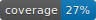

# GRYLibrary

[](https://www.codefactor.io/repository/github/aniondev/grylibrary/overview/main)



GRYLibrary is a collection with some useful .NET classes and functions which are very easy (re)usable.

The GRYLibrary follows the declarative-programming-paradigm where possible:

You should say what you want to do, and not how to do it. This paradigm results in code which is easy to understand and can be written very quickly without loosing the overview of your code.

## Getting Started

### Usage

[](https://www.nuget.org/packages/GRYLibrary) 

Install the GRYLibrary as NuGet-package using the Package Manager Console:

```bash
Install-Package GRYLibrary
```

## Reference

The GRYLibrary-reference can be found [here](https://aniondev.github.io/GRYLibraryReference).

## Build

This product requires to use `scbuildcodeunits` implemented/provided by [ScriptCollection](https://github.com/anionDev/ScriptCollection) to build the project.

## Changelog

See the [Changelog-folder](./Other/Resources/Changelog).

## Contribue

Contributions are always welcome.

See [Contributing.md](./Contributing.md) for information about that.

## Repository-structure

This product uses the [CommonProjectStructure](https://projects.aniondev.de/PublicProjects/Common/ProjectTemplates/-/blob/main/Conventions/RepositoryStructure/CommonProjectStructure/CommonProjectStructure.md) as repository-structure.

## Branching-system

This product follows the [GitFlowSimplified](https://projects.aniondev.de/PublicProjects/Common/ProjectTemplates/-/blob/main/Conventions/BranchingSystem/GitFlowSimplified/GitFlowSimplified.md)-branching-system.

## Versioning

This product follows the [SemVerPractise](https://projects.aniondev.de/PublicProjects/Common/ProjectTemplates/-/blob/main/Conventions/Versioning/SemVerPractise/SemVerPractise.md)-versioning-system.

## License

There are the following licenses for the GRYLibrary available

- The GRYLibrary is generally and commonly licensed under the terms of GRYL. The concrete license-text can be found [here](https://raw.githubusercontent.com/anionDev/GRYLibrary/main/License.txt). This license-text does obviously not apply to the other following licenses.
- There are some special licenses for certain scopes:
  - [epew](https://github.com/anionDev/ExternalProgramExecutionWrapper) is allowed to use the [Nuget-release](https://www.nuget.org/packages/GRYLibrary) of the GRYLibrary under the Terms of the MIT-license for executing programs as main-purpose of epew and for nothing else.
  - [ReliablePlayer](https://github.com/anionDev/ReliablePlayer) is allowed to use the [Nuget-release](https://www.nuget.org/packages/GRYLibrary) of the GRYLibrary under the Terms of the MIT-license to help implement features provided in the official repository and release of ReliablePlayer and for nothing else.
- If you need another license-type or you want to use the GRYLibrary in your company then please contact the owner of the GRYLibrary.
